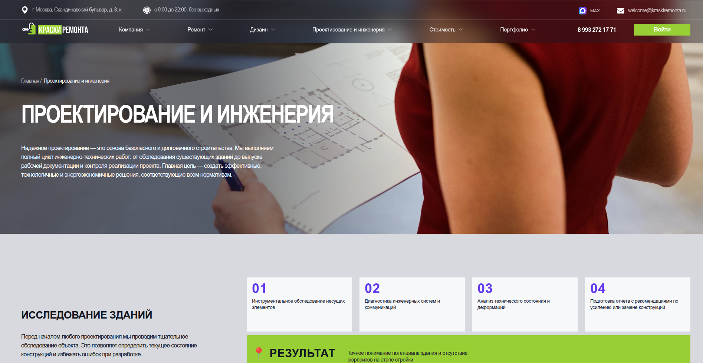
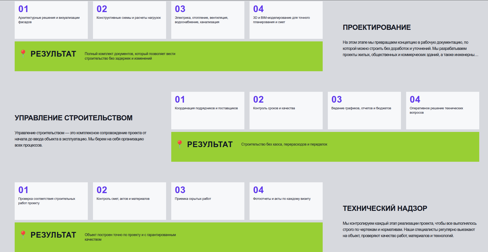

# TUR FIN

Одностраничный сайт на Vue 3 + Vite c настроенными стилями под дизайн.

## Стек

- Vue 3
- Vite
- CSS

## Структура проекта

- `src/App.vue` — основная разметка страницы
- `src/assets/app.css` — все стили проекта
- `src/assets/images` — изображения, используемые на странице
- `src/main.js` — точка входа и подключение глобальных стилей

## Запуск проекта

```bash
npm install
npm run dev
```

Сборка production-версии:

```bash
npm run build
npm run preview
```
## Скриншоты




